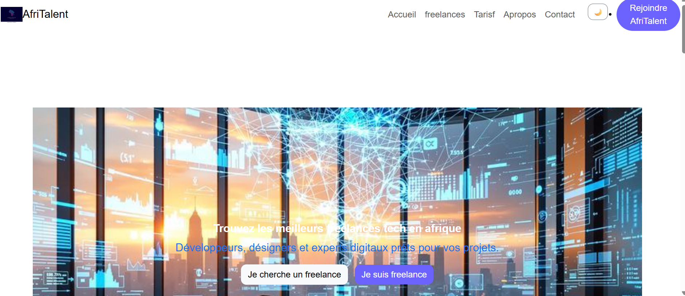
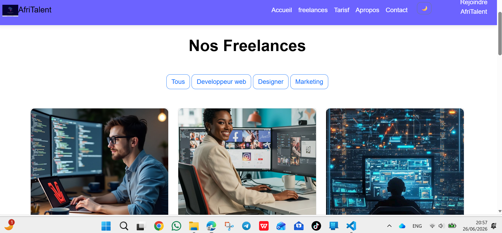
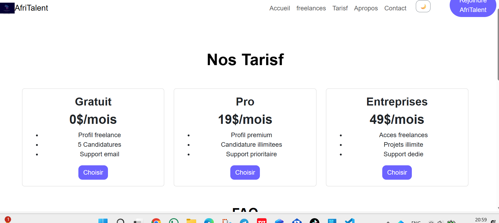
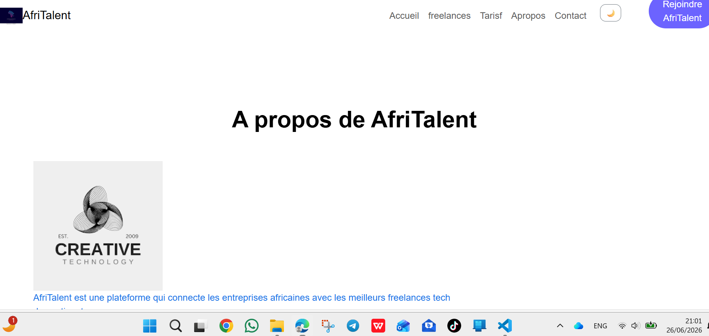
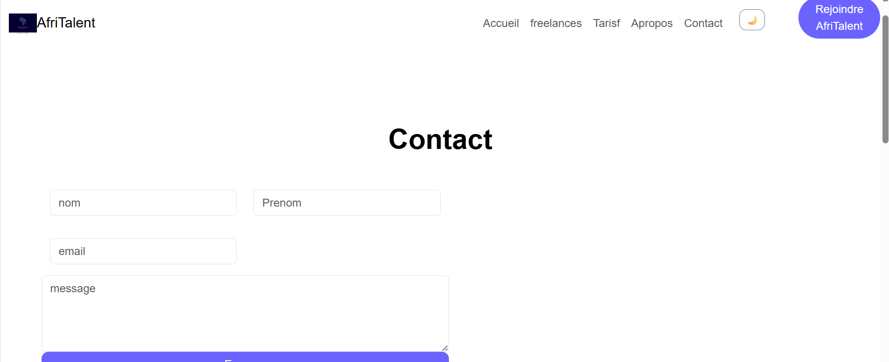

# AfriTalent 
Projet fil rouge — Plateforme de mise en relation entre freelances africains et 
clients. 
Auteur : Prenom NOM 
Promotion : L2 Web — ISI

# Demo en ligne

 [Voir le site](https://kandjiramata27-png.github.io/Ramatakandji-AfriTalent/)

 # AfriTalent

AfriTalent est une plateforme web qui met en relation des entreprises et des freelances africains.
Le site permet de consulter de profils de freelances,de decouvrir les offres tarifaires, d'obtenir des information
sur la plateforme et de contacter l'equipe via u formulaire.
Le projet a ete developper avec HTML,CSS,Bootstrap et JavaScrip, en mettant l'accent sur un design responsive et une navigation fluide.

-HTLM5 : structure et contenu des pages web.
-CSS : mise en forme, couleurs, animation et design responsive.
-Bootstrap : grille responsive, composants(navbar,carte,formulaire,accordeon,boutons,etc.)
JavaScrip : interactions dynamiques,validation du formulaire de contact , filtrage des freelances,compteur anime,bouton de retour en haut et mode sombre.

